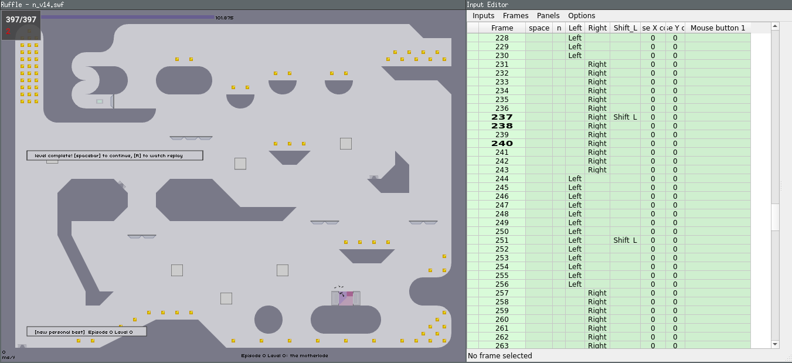

# N v1.4 TAS

Info & tooling for making a Tool-Assisted Speedrun (TAS) for the popular 1.4 version of [Metanet N - the way of the Ninja](https://www.metanetsoftware.com/game/n).



Videos produced with this tool:
- Videos compiling [Speedrun](https://www.youtube.com/watch?v=ABvl85d5Nic&t=664s) and [Highscore](https://www.youtube.com/watch?v=StWH8q4TDDU&t=10s) 0th (RTA scores)
- [Column 0 TAS](https://www.youtube.com/watch?v=SDcWJzEX7LY)

## What this repository contains

- Information about TASing N v1.4 (this file)
- [python script to convert N demos into libTAS inputs](converter.py)
- [bash](build_demo.sh) and [python](builder.py) scripts working together to recreate the libTAS demo from [level demo data](tas/level_data.yml)
- [Data to build the TAS](tas/): info for each level (including demos), loading times, click coordinates
- [Script to create level data from a local database](make_rta_level_data.py) (used to create [RTA data](tas/level_data_rta.yml))
- [Advanced lua script to help with TASing N: extracts player position and speed from memory, displays hitboxes, draws path, saves best position](volume/lua/n_start.lua)
- [Lua script to display overlay information](display_infos.lua.template) (demo information, real-time inputs)
- [Other Lua scripts to help TASing](volume/lua)
- [Python script to get demo data from .sol file](sol_to_demo.py)
- [Python script to get statistics about current state of the TAS](stats.py) -> produces [tas/stats.txt](tas/stats.txt)
- [Notes for each TASed level](tas/annotations.md)
- [A dockerfile to build the TASing environment](Dockerfile)
- [Other tools and informations from external sources](external/)

And more.

## Links
### Instruction pages
- https://tasvideos.org/EmulatorResources/LibTAS
- https://tasvideos.org/EmulatorResources/LibTAS/Usage
- https://tasvideos.org/EmulatorResources/Ruffle
- https://tasvideos.org/Platforms#AdobeFlash
### Tools & their bugtrackers
- https://github.com/clementgallet/libTAS
- https://github.com/clementgallet/libTAS/issues
- https://github.com/ruffle-rs/ruffle/issues
- [JPEXS](https://github.com/jindrapetrik/jpexs-decompiler) (flash decompiler)
- [Flare](http://www.nowrap.de/flare.html) (another flash decompiler) -> used to dump the whole code in a single file
### Forums
- [Discord channel where we discuss this TAS](https://discord.com/channels/197765375503368192/199460839252688896)
- [TAS thread on N forum](https://forum.droni.es/viewtopic.php?f=20&t=4468&p=177293&sid=6f5f179201d5b44d889afbe5865cb685#p177293)
- [tasvideos.org: N TAS](https://tasvideos.org/Forum/Topics/9371)
- [tasvideos.org: Running Flash games in libTAS](https://tasvideos.org/Forum/Topics/20547)
### Documentation
- [Thread on air speed](https://forum.droni.es/viewtopic.php?f=20&t=10336&sid=569eab4beeecd814135f67b0fa574a3a)
- [Stumbles](https://discord.com/channels/197765375503368192/199460839252688896/1431062811903266957)
- [Hitboxes sizes](https://discord.com/channels/197765375503368192/199460839252688896/1437946735665352714)
- [Finding coordinates for tile bwj](techniques/bwj.md)
- [Drone detection](https://discord.com/channels/197765375503368192/199460839252688896/1458621494224490527)
- [Metanet tutorial on N physical collision system](https://edelkas.github.io/n/index/docs.html)
- [Nclone, Python emulator of the N++ engine (some parts are similar to N v1.4)](https://github.com/SimonV42/nclone)
  - [Nclone: Part handling ceiling crushing](https://github.com/SimonV42/nclone/blob/842190b2a216579b5b5c551e0a0b4505fc3381cc/nsim.py#L299-L302)
- [Float-precise trick giving pj on flat ground in N++](https://discord.com/channels/197765375503368192/199460839252688896/1469859845107876041)
- [Slipping through one-ways](https://forum.droni.es/viewtopic.php?f=17&t=9096)
### TAS Tutorials for other games
- Undertale https://www.youtube.com/watch?v=EFCnTeTdD2k&t=712s
- HK https://www.youtube.com/watch?v=qQAJk5_LUvg
### Bruteforcers from other games
- [jaffarPlus](https://github.com/SergioMartin86/jaffarPlus) (can work with libTAS)
- [Trackmania's bruteforce](https://donadigo.com/tminterface/what-is-bf)

## Todo
- Extract ninja state https://discord.com/channels/197765375503368192/199460839252688896/1465895994767183942
- Project tile penetration for cj optimization
- Bruteforcer for walljumps
- Bruteforcer for cj and rcj
- Bruteforcer for double bb jump
- speed extraction still doesn't work for some grounded levels: 01-0, 02-0, 03-1, 37-0, 63-1, 80-2, 81-0, 82-0, 87-0, 88-1
- TAS the remaining 306 levels ;)

## Install

### Linux

Just pull the docker images:

```
docker pull cmatteperdu/libtas_n:latest
docker pull cmatteperdu/libtas_n_recording:latest
```

Or, if you want to build the docker images yourself (much slower: this will take a long time as it's rebuilding ruffle and libTAS from source):

```
docker build --tag libtas_n .
docker build -f Dockerfile_recording --tag libtas_n_recording .
```

#### Run

```
docker run -it --rm -e DISPLAY=$DISPLAY -v /tmp/.X11-unix:/tmp/.X11-unix -v $HOME/.Xauthority:/root/.Xauthority:rw --net=host -v /home/$whoami/nv14_TAS/volume:/home/ cmatteperdu/libtas_n
```

Inside container:
```
libTAS /usr/local/bin/ruffle_desktop -g gl --no-gui /home/n_v14.swf &
```
(Or just press up arrow, as these commands are saved as previous command in bash history)

### Windows

In order to make it possible to TAS any game, libTAS uses tools that do not work properly in Windows. For that reason, it only works on Linux. If you're on Windows, you can use the Windows Subsystem for Linux (WSL) to run libTAS.

To install WSL for libTAS, please follow Step 1 of this guide: https://clementgallet.github.io/libTAS/guides/wsl/ . If you're on Windows 10, you will also need to follow step 3 (installing VcXsrv).

Once you have WSL set up, [install docker desktop](https://docs.docker.com/desktop/setup/install/windows-install/) on Windows. Inside docker desktop, check "Use WSL 2 based engine" is active in settings (it should be checked by default).

Clone the repository:
```
git clone https://github.com/Perdu/nv14_TAS.git
```

Move to the repository:

```
cd nv14_TAS
```

Then pull the docker images (to rebuild them, see the Linux section):

```
docker pull cmatteperdu/libtas_n:latest
docker pull cmatteperdu/libtas_n_recording:latest
```

#### Run

```
docker run -it --rm -e DISPLAY=$DISPLAY -v /mnt/wslg/.X11-unix:/tmp/.X11-unix -v $HOME/.Xauthority:/root/.Xauthority:rw -v $PWD/volume:/home cmatteperdu/libtas_n
```

Then inside the container, press the up arrow key and you will have the command the run libTAS (you can change the level at the beginning of the line or inside libTAS).

## Usage

### Basic libTAS usage

https://github.com/clementgallet/libTAS?tab=readme-ov-file#run

https://tasvideos.org/EmulatorResources/LibTAS/Usage
- frame advancing, using the V key
- pause/play, using the C key
- fast forward, using the tab key

Use Shift+F1-10 to save state and F1-10 to reload state.

Use Ctrl+F1-10 to reload a *branch*. A branch is created automatically when creating the associated savestate. Basically, this allows you to reload inputs the way they were defined when you made the savestate (be careful to make a savestate before loading a branch to avoid losing your progress).

You can press on individual frames to go there, provided you have a saved state before

One useful trick to compare several paths is to set options in the menu editor "disable autoscrolling" and "rewind seeks to current frame". Place yourself at a given frame, then edit earlier frames to see where that lands on current frame. This is very useful for micro-optimizations.

### TASing a N level

If no `.ltm` file already exist for that level (in [volume/n_levels/](volume/n_levels/)), create one using either:
- `./start_tas_level.sh 00-0` to create an empty one with no input
- `./start_tas_level.sh 00-0 rta` to create one with inputs from the 0th preloaded
- `./start_tas_level.sh 00-0 hs` to create one with inputs from the highscore TAS (if one exists)
- `./start_tas_level.sh 00-0 demo` to create one with inputs from a demo string (you will be prompted for it)

You can then proceed with TASing the level.

Upon launching the level, the script will perform automatic actions to extract valuable information from memory. Let it load until it's settled.

Place your notes in `Movies -> Annotations...`. Write things you tested that didn't work so that others know they're empty routes.

If you have an alt route that you want to keep, place it in a savestate (e.g. 9) and write it in the annotations.

To register a position (and try to beat it with other routes), place a space key on the frame before it, then advance one frame. The script will delete the space key, create a savestate, and save the position. You should now see a yellow circle indicating that best position, and the position of this path compared to the position of the current route at the bottom of the screen. Small indicators on the left show whether current path compares to that best path (as in being more to the left or right, up or down).

Once you're done and want to obtain the demo data:
- *Inside the docker container*, run: `./get_sol_file.sh` (this copies the sol file in a place we can get it from outside of the container)
- in the repository folder, run: `python sol_to_demo.py --save 00-0`. This will obtain the demo data and place it correctly in [tas/level_data.yml](tas/level_data.yml).

### Overriding .sol file

If the current demo did not override the score in the .sol file (for instance because it didn't save a frame) but you want to get the demo string anyway, you can:
- inside the docker container, run `./use_sol_file.sh --override` (this will place a .sol file with low scores at the right place)
- restart the game and run it through the end

### Updating infos

`./update_infos.sh` will automatically:
- extract annotations from all existing ltm files and place them in [tas/annotations.md](tas/annotations.md) (this will take a few seconds).
- update [tas/stats.txt](tas/stats.txt)
- update the number of remaining levels in the Readme

### Editing ltm files

ltm files are zip archives. If for any reason you need to manually edit their content, you can extract them using (you might need to create the extract folder first):

```
tar xzf volume/n_levels/00-0.ltm -C extract/
```
Edit the files in the extract folder, then recompress the archive using:

```
tar czf volume/n_levels/00-0.ltm -C extract . --transform='s|^\./||'
```

### Contributing to this repository

If you want to be able to push directly to this repository, you need to:
- [create a github account](https://github.com/signup)
- ask me to give you write permission on the repository
- Optionnally, to avoid having to enter credentials every time, you may want to [create an SSH key](https://docs.github.com/en/authentication/connecting-to-github-with-ssh/generating-a-new-ssh-key-and-adding-it-to-the-ssh-agent), set it up [here](https://github.com/settings/keys), then clone the repository using `git clone git@github.com:Perdu/nv14_TAS.git` instead of the HTTPS method you most probably used.

Then after [TASing a level](#tasing-a-n-level):
- run `git pull` to avoid potential conflicts
- Add the newly created ltm file: `git add volume/n_levels/00-0.ltm`
- Create a *commit* with a message indicating what you did: `git commit -am "Add 00-0, 100f faster than 0th"`
- Push the commit to the repository: `git push`

When confused, you can get information with `git status`.

## Statistics

Various statistics about the current state of the TAS can be obtained using:

```
python stats.py
```

## Video encoding

### Automated method

There's a docker image with the correct options already configured to record. To build it:

```
docker build -f Dockerfile_recording --tag libtas_n_recording .
```

To run it:

```
docker run --rm -it -e DISPLAY=$DISPLAY -v /tmp/.X11-unix:/tmp/.X11-unix -v $HOME/.Xauthority:/root/.Xauthority:rw --net=host -v /home/$whami/nv14_TAS/volume:/home/ cmatteperdu/libtas_n_recording
```

It will also be launched automatically if you use:
```
./build_demo.sh -s 0 --record
```

Or even more straightforward, for a single level:

```
./encode.sh --ghost 00-0
```

### Manual method

- Disable `Settings → Audio → Audio Control → Disable` to have sound in encoding.
- Configure destination in `Tools → Configure encode...`
- Start encoding: `Tools → Start encode`
- Then run the level(s) until the end and close

### Adding ghost

- Load the lua [n_ghost.lua](volume/lua/n_ghost.lua) script
- in libTAS, go to `Settings -> Video` and activate "Lua on video encode"

### Record demo for one or several episodes

- Build the demo data: `./build_demo.sh -s 0 -e 9`
- In libTAS, configure options for recording (see above)
- load the `n_speedrun.ltm` file

### Upscaling

I used default settings for encoding.

Since youtube will downgrade videos smaller than 720p to 30fps, I adding an upscaling setting to ensure it stays in 60fps. it can be redone manually on other videos:

```
ffmpeg -i 'n_rta_hs.mkv' -vf scale=-1:720 'n_rta_hs_upscaled.mkv'
```

This significantly *reduced* the size of the video because the fixed bitrate is removed (although... Sometimes. Not always).

## Known issues

Troubleshooting: see [troubleshoot.md](doc/troubleshoot.md)

No sound: this is normal and you don't need it. See [sound/README.md](sound/README.md) if you really want it.

### Texture problem
Reported [here](https://github.com/ruffle-rs/ruffle/issues/21776)

Ruffle does not properly display all textures.

Adding `-g gl` removes error in stdout, but doesn't solve the issue.

N2 (swf Linux version) does not have the issue

## Technical information for submission

See [doc/technical_info.md](doc/technical_info.md)

## Optimization level in tas/level_data.yml

Jumping gives slightly more speed than running. As I was not aware that this kind of subpixel optimization was possible in this game (and because it takes a lot of time to optimize), this is not done for a lot of level. I indicate this in the [level demo data](tas/level_data.yml) file, with `optimization_level`:
- 1 (or nothing): level TASed without subpixel optimization
- 2: level TASed with subpixel optimization
- 3: level TASed with distance to wall micro-optimization
