# List of all techniques for N

Todo: detail all techniques, ideally with gifs, similar to what can be found [here](https://tasvideos.org/GameResources/NES/Rockman).

Links:
- [Thread on air speed](https://forum.droni.es/viewtopic.php?f=20&t=10336&sid=569eab4beeecd814135f67b0fa574a3a)
- [Stumbles](https://discord.com/channels/197765375503368192/199460839252688896/1431062811903266957)
- [Hitboxes sizes](https://discord.com/channels/197765375503368192/199460839252688896/1437946735665352714)
- [Finding coordinates for tile bwj](techniques/bwj.md)
- [Drone detection](https://discord.com/channels/197765375503368192/199460839252688896/1458621494224490527)
- [Metanet tutorial on N physical collision system](https://edelkas.github.io/n/index/docs.html)
- [Nclone, Python emulator of the N++ engine (some parts are similar to N v1.4)](https://github.com/SimonV42/nclone)
  - [Nclone: Part handling ceiling crushing](https://github.com/SimonV42/nclone/blob/842190b2a216579b5b5c551e0a0b4505fc3381cc/nsim.py#L299-L302)
- [Float-precise trick giving pj on flat ground in N++](https://discord.com/channels/197765375503368192/199460839252688896/1469859845107876041)
- [Slipping through one-ways](https://forum.droni.es/viewtopic.php?f=17&t=9096). [Map](https://www.nmaps.net/218275)
- [Superpowered launchpads + surviving falls from launchpad height](https://discord.com/channels/197765375503368192/199460839252688896/1477389682181668915)
- [In-between-tile slope jumps](https://discord.com/channels/197765375503368192/199460839252688896/1483352718503444581)
- [2-frames depenetration](https://discord.com/channels/197765375503368192/199460839252688896/1486849823285051565)
- [Locked-door walljump](https://discord.com/channels/197765375503368192/199460839252688896/1488577463406690394)

## Common in RTA

### Stumbles
### Corner Jump (cj)

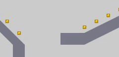

### Reverse Corner Jump (rcj)

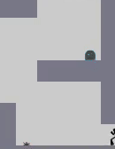

### Perpendicular (reverse) Jump (pj)

### Corner kick (ck)

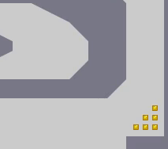

### Bounceblock Backward Walljump (bbbwj) (high and low) (+optimization)

High: 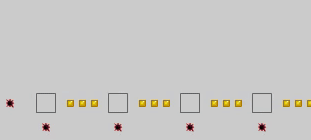

Low: 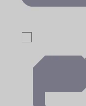

Side: 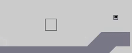

### Thwump bwj (+optimization)

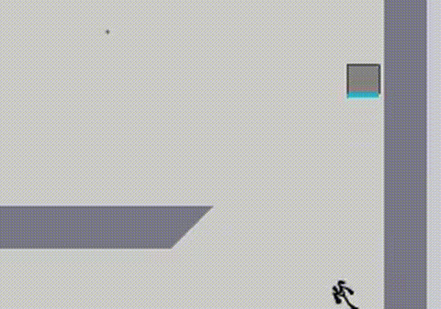

### thwump push (+optimization)

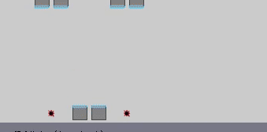

### Clipping through oneways using corners
### Double bb
### Triple bb
### Bounceblock Corner Double (bbcd)

Double bb w/ bwj

### Bounceblock Corner Triple (bbct)

Triple bb w/ bwj

(actually TAS only but it doesn't make sense to separate explanations. Categories could be reworked or we could have a whole bounceblock category)

### Sideways double/triple bb
### chimney jumps
### Ceiling push

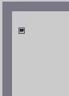

### Corner shove

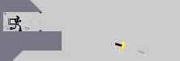

### Corner push

57-0 but there are better ones

### Getting squeezed (by thwumps mostly)

### lp+wj

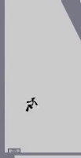

### Angled lp+wj

A bit harder version of the lp+wj. With a precise positioning and jump press, you can get propelled horizontally along with the vertical propulsion.

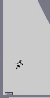

### Taking only 1 stacked object

00-1 but visibility is not the best

## Rare in RTA

### Clipping
### Backwards walljump (bwj)

07-2

19-2

Tile: 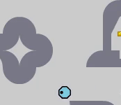

Turning 1 frame before jumping off the wall (slowed): 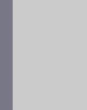

### Tile wj

06-2

### Tile rcj

06-2

### Ledge grab

(They may actually just be a ceiling push)

19-3

## TAS-only (/optimization)

### Quadruple bbwj

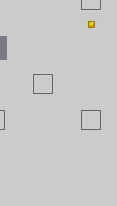
Slowed: 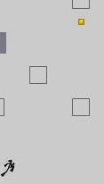

18-4

### Tile bwj

08-2

18-3

### cj optimization
### Slope jump optimization
### Clipping through oneways
### Supercharged lp
### lpwj (jumping through lp)
### wj optimization
### Surviving high-speed chimney jumps
### Exit door hitbox optimization
### Jumping to maximize speed
### Non-slowing stumbles

49-2

### Turnarounds optimization

19-0

### Delaying drone detection

As explained [in the tutorials](https://edelkas.github.io/n/index/docs/tutoC.html#section1), drones do not detect on a fixed frame. The actual frame depends on how busy the objects manager is:
> (D) visibility queries/AI updates
>
> Casting rays through the world is a fairly costly process. in order to maintain a fast framerate, we implemented "staggered" AI updates; any object which requires costly updates (such as raycasts for visibility) can subscribe to the Think event. Each time the simulation is ticked, SOME of the objects are allowed to Think(); this way, the cost of the raycasts/etc. is spread over several frames. The tradeoff is that objects don't respond instantly; there are a few frames between a change in visibility (i.e. the ninja becoming visible to an enemy) and the corresponding change in logic (the enemy being aware of the change in visibility). However, since the game is ticked at 40hz, a delay of even 10 ticks is short enough to not make a substantial difference. 

As a result, it is occasionnaly possible to delay drone detection by interacting with objects. This includes:
- touching bounce blocks
- (todo)

(todo: gif with the beginning of 19-1)

## Near impossible (even for TAS)

### Locked door walljump

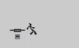

> $###00000000000000000000000000000000000000000000000000000000000000000000000000000000000000000000000000000000000000000000000000000000000000000000000000000000000000000000000000000000000000000000000000000000000000000000000000000000000000000000000000000000000000000000000000000000000000000000000000000000000000000000000000000000000000000000000000000000000000000000000000000000000000000000000000000000000000000000000000000000000000000000000000000000000000000000000000000000000000000000000000000000000000000000000000000000000000000000000000000000000000000000000000000000000000000000000000000000000000000000000000000000000000000000000000000000000000000000000000000000000000000000000000000000000000000000000000000000000000000|5^370.9,333.7797758985!9^348,348,1,0,14,14,1,0,-1#999:36573457#

## Other info

(such as directional keys
being blocked after a certain speed)
